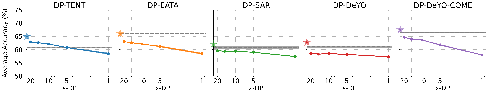

<h1 align="center">Private and Stable Test-Time Adaptation with Differential Privacy</h1>

<p align="center">
  <a href="https://openreview.net/forum?id=Ct0HIcLIMX">
    
  </a>
  <a href="https://arxiv.org/abs/2606.01908">
    
  </a>
</p>

This repository contains the official implementation of our ICML 2026 paper.

### Overview
<p align="center">
  
</p>
Test-time adaptation (TTA) updates a model during inference to reduce errors under distribution shift. However, these updates make the model parameters depend on test inputs, raising privacy concerns for the testing data.

We study this issue by converting several popular TTA methods into differentially private variants. Our DP-TTA methods apply per-sample gradient clipping and Gaussian noise to test-time updates. On ImageNet-C, we find that DP-TTA provides privacy with only modest accuracy and computational costs. In low-privacy regimes, the clipping mechanism can also improve the accuracy and stability of continual adaptation.

This repository includes implementations for:

1. Non-private TTA baselines: Tent, EATA, SAR, DeYO, and DeYO-COME.
2. Clipping-only variants using per-sample gradient clipping without Gaussian noise.
3. Differentially private variants using per-sample clipping and Gaussian noise.
4. Evaluation on ImageNet-C and ImageNet-R with ViT and ConvNeXt models.

We provide tuned reproduction scripts for the main ImageNet-C + ViT experiments reported in the main paper.
The continual scripts reproduce the ImageNet-C + ViT continual adaptation results in Table 1 and Table 8. 
The episodic scripts reproduce the ImageNet-C + ViT episodic adaptation results in Table 6 and Table 9.

Feel free to adapt the code to your own models, datasets, and TTA methods!

### Setup
Install dependencies by `pip install -r requirements.txt`.

### Data
The main experiments use [ImageNet-C](https://github.com/hendrycks/robustness) with [ImageNet](https://www.image-net.org/) validation images. Please prepare the datasets locally and pass their paths to main.py:

For example::
```
python main.py \
  --data /path/to/imagenet \
  --data_corruption /path/to/imagenet-c \
```

### Running Experiments
The complete commands for reproducing the paper results are provided under:
```
scripts/
```
The scripts include commands for DP methods, clipping-only methods, and non-private baselines.

We recommend setting the data and output paths before running.

For continual adaptation, run:
```
bash scripts/continual/baselines.sh
bash scripts/continual/clip_only.sh
bash scripts/continual/dp_version.sh
```
For episodic adaptation, run:
```
bash scripts/episodic/baselines.sh
bash scripts/episodic/clip_only.sh
bash scripts/episodic/dp_version.sh
```

#### Example

We use two test-time adaptation settings:
```
--reset 0: continual adaptation, where the model is not reset between corruption shifts.
--reset 1: episodic adaptation, where the model and optimizer are reset before each corruption shift.
```

The main privacy and adaptation hyperparameters are:
```
--max_norm  # per-sample gradient clipping norm
--noise     # DP noise multiplier
--lr        # learning rate for test-time updates
```
The other main arguments are:
```
--algorithm   # TTA method, e.g., tent, tent_clip, tent_dp
--arch        # source model architecture, e.g., vit or convnext
--batch_size  # test-time batch size
```
For clipping-only methods, we apply per-sample gradient clipping without adding Gaussian noise. The noise multiplier is set to `0`:
```
python main.py --algorithm tent_clip --arch vit --batch_size 64 --reset 0 \
  --max_norm 0.1 --noise 0 --lr 0.5
```

For DP versions, we apply both per-sample gradient clipping and Gaussian noise. The noise multiplier varies across privacy levels:
```
python main.py --algorithm tent_dp --arch vit --batch_size 64 --reset 0 \
  --max_norm 0.1 --noise 0.6186 --lr 0.1 
```

The complete commands to replicate results in the paper are included in `/scripts/`.


#### Applying Per-sample Gradient Clipping to Other TTA Methods:
We use [Opacus](https://opacus.ai/) for per-sample gradient clipping. To use it for other TTA methods:

1. Wrap the PyTorch model object with `GradSampleModule`.
2. Wrap the optimizer with `DPOptimizer`.
3. Set noise to `0` to enable per-sample gradient clipping with no DP noise.
```python
from opacus import GradSampleModule
from opacus.optimizers import DPOptimizer
from opacus.validators import ModuleValidator

errors = ModuleValidator.validate(model)  # check compatibility
model = GradSampleModule(model)
optimizer = torch.optim.SGD(params, lr, momentum=0.9)
optimizer = DPOptimizer(optimizer=optimizer, noise_multiplier=noise, 
                        max_grad_norm=max_norm, expected_batch_size=args.batch_size)
```

### Citation
If you find this code useful, please cite:
```
@inproceedings{
li2026private,
title={Private and Stable Test-time Adaptation with Differential Privacy},
author={Zefeng Li and Qiaoyue Tang and Mathias L{\'e}cuyer and Evan Shelhamer},
booktitle={Forty-third International Conference on Machine Learning},
year={2026},
url={https://openreview.net/forum?id=Ct0HIcLIMX}
}
```

### Acknowledgements

This code is heavily inspired by and partly adapted from several open-source TTA implementations, including [Tent](https://github.com/DequanWang/tent), [EATA](https://github.com/mr-eggplant/EATA), [SAR](https://github.com/mr-eggplant/SAR), [DeYO](https://github.com/Jhyun17/DeYO), and [COME](https://github.com/BlueWhaleLab/COME).